# Deepin系统安装与使用教程

## 写在前面:

本教程以Deepin 15.10.1 系统为例, 其他版本的Deepin系统也类似.不过为了让我们能愉快的安装使用,建议使用最新的操作系统.
本教程开始之前默认你已经备份了你的数据。

### 本教程分为以下几个步骤:

- [安装前准备](#安装前准备)

  - [确认电脑所适用的系统类型](###确认电脑所适用的系统类型)

  - [选择并下载系统镜像](#选择并下载系统镜像)

- [启动盘的制作](#启动盘的制作)

  - [下载制作工具](#下载制作工具)

  - [启动盘的写入](#启动盘的写入)

- [系统的安装](#系统的安装)

  - [从U盘启动](#从U盘启动)

  - [安装系统](#安装系统)

- [系统的激活](#系统的激活)

### 你需要以下设备:

- 一个大于8G或8G以上的u盘 

- 一个可以连接网络的系统正常windows电脑

- 待装系统的电脑

注: 如果待装系统的电脑目前可正常运行，则可以不用第二台电脑

下面来介绍具体的操作步骤

---

## 安装前准备

---

### 确认电脑所适用的系统类型

**如果我们知道电脑适用64/32位操作系统可跳过此步骤**
我们要安装的系统需要与电脑硬件相匹配.下面我们来确认电脑所适用的系统

- 如果您的电脑还可以开机且您的电脑是windows 7系统:
  - 首先右键点击”计算机”,选择属性

    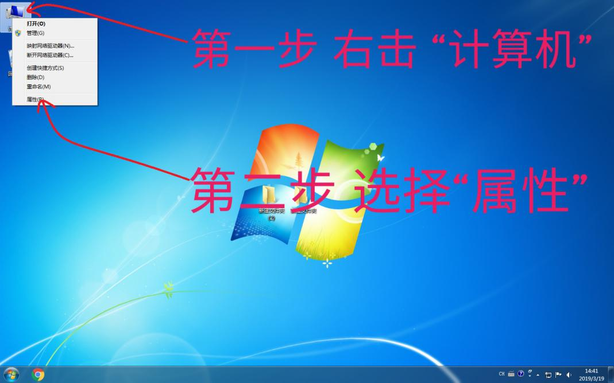

  - 下图中框处表示这台电脑适用64位的操作系统
    
    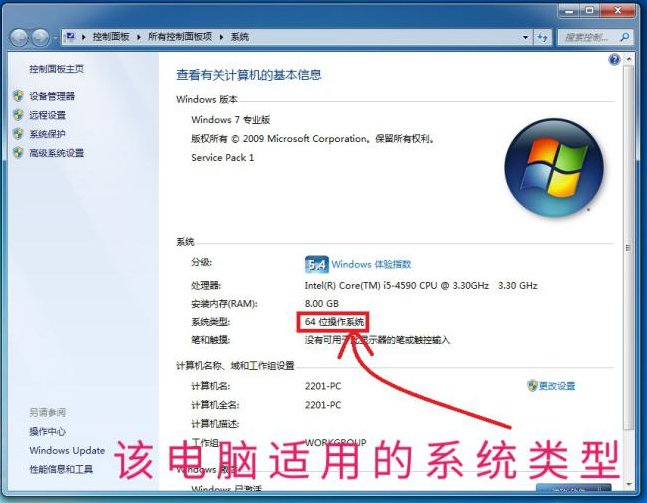

- 如果您的电脑能开机且是windows10系统:

  - 点击windows图标打开开始页面，然后点击齿轮图标进入设置页面
    
    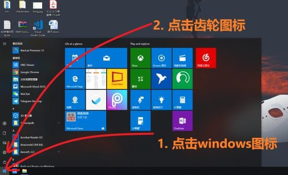
  
  - 点击”系统”
  
    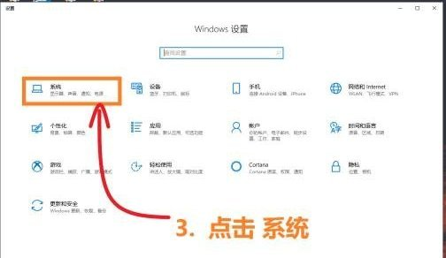
  
  - 点击 “关于”，图中第二个框中表示这台电脑适用64位的操作系统
  
    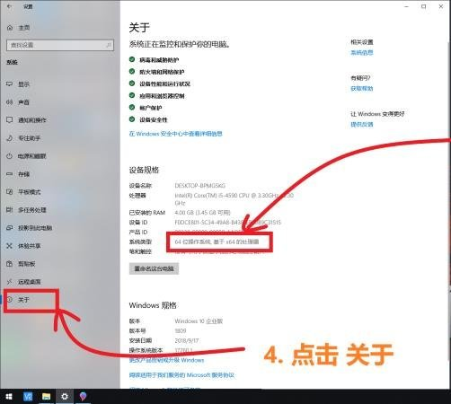

- 如果你的电脑无法开机，搜索 **”CPU型号+指令集“** 以确认你的电脑所适用的系统。
  
**注意**：大多数电脑都是64位的

### 选择并下载系统镜像

- 打开云南大学校园软件[正版化服务平台](http://ms.ynu.edu.cn/)并点击下图中的微软应用下载!

    

- 点击windows 10 专业版

    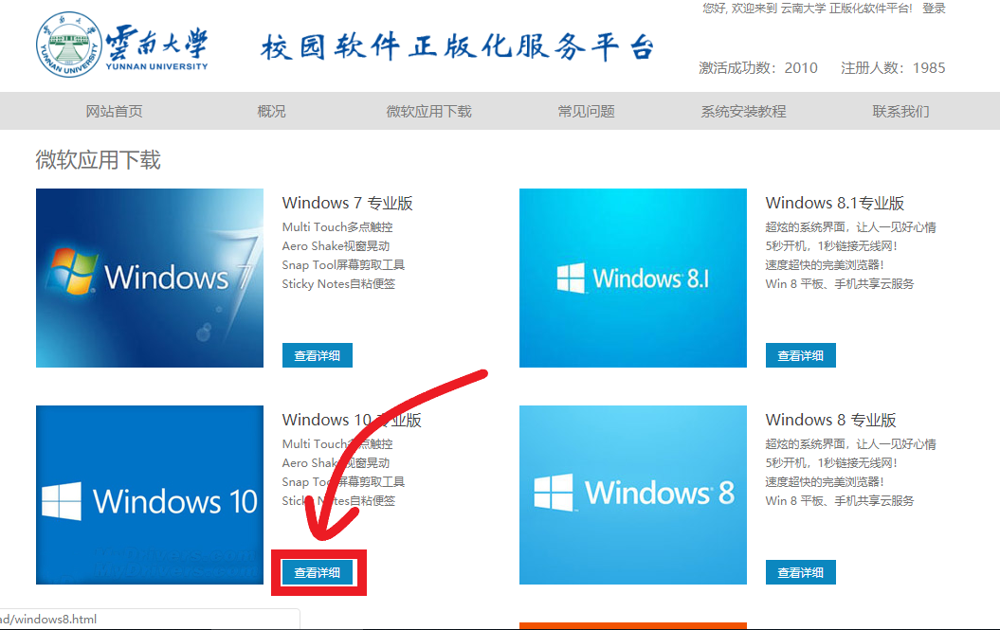

- 点击选择框**选择适用的系统**(此处以64位为例)

    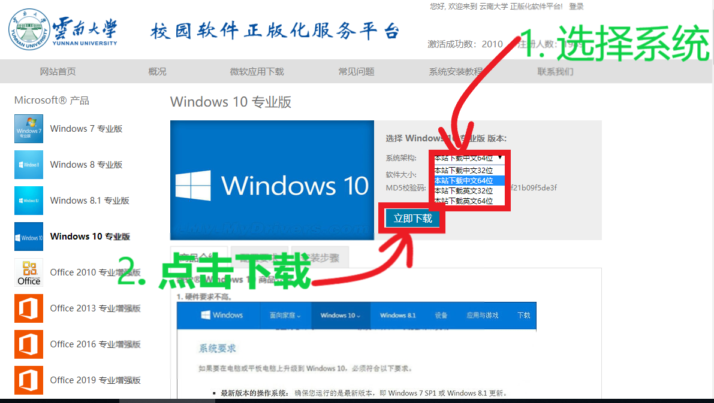

- 点击下载按钮会跳转到统一身份认证页面，填入学号/工号与密码认证

    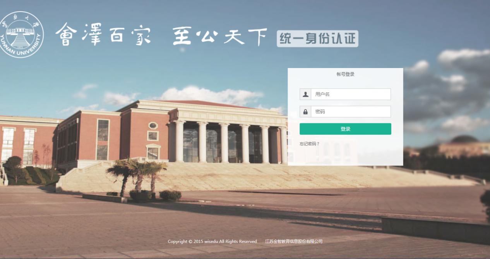

- 认证完成会跳转回下载页面 重新点击即可开始下载
  

---

## 启动盘的制作

---

>什么是启动盘?
我们知道,电脑系统是安装在硬盘上的,实际上启动盘就是在U盘上安装了一个小系统.而这个小系统是来帮助我们 将功能健全的系统安装在其他硬盘. 制作启动盘的过程就是在U盘安装这个小系统的过程.我们在之前下载的win10的镜像包含了这个小系统和完整的windows系统.即这个‘小系统’也就是我们的系统安装程序。
不理解也没关系,只要跟着下面的步骤做就没问题

### 下载制作工具

>Rufus是一个可以帮助格式化和创建可引导U盘（Live USB）的工具，可以制作Windows、Linux、Android-x86 等操作系统的启动盘。-维基百科

- 打开[Rufus的官网https://rufus.ie/](https://rufus.ie/) 

    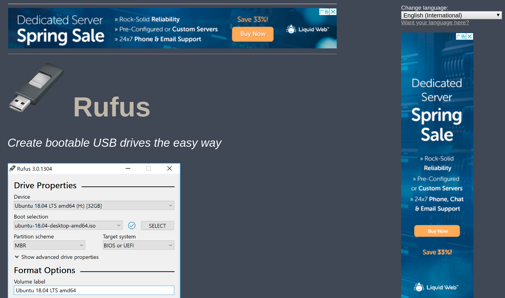

- 将页面下滑我们可以看到大大的Download点击下面的最新版本即可开始下载，在这里我们用的是Rufus 3.5版本

    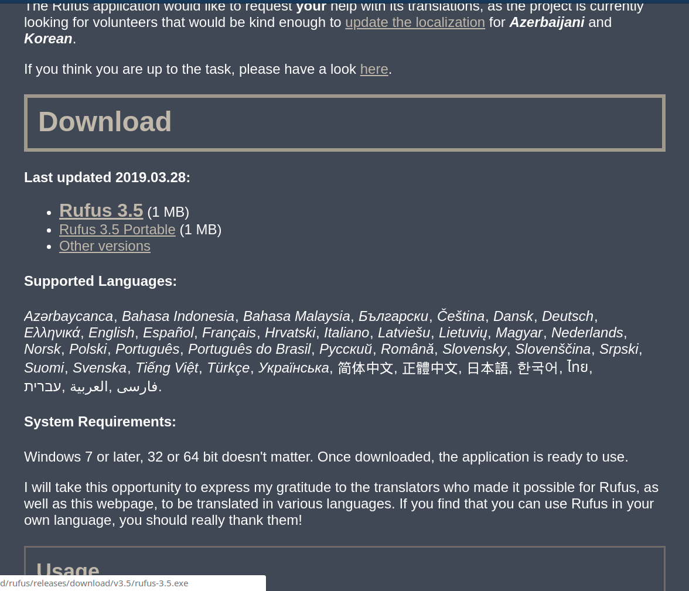

- 下载结束后我们双击我们下载文件即可打开软件

  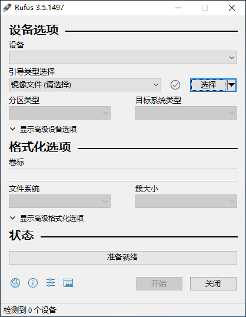

### 启动盘的写入

- 我们这时插入我们的U盘，在下面的框中会显示我们的U盘，如果你的电脑连接了多个U盘注意一定要选择正确，**制作启动盘会擦除U盘中的数据！**

    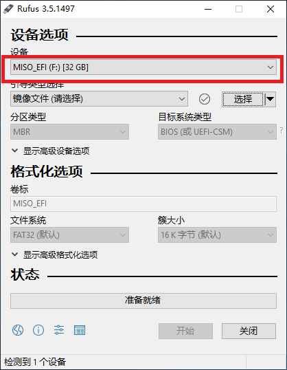
- 接着我们点击下图中的**选择**
  
    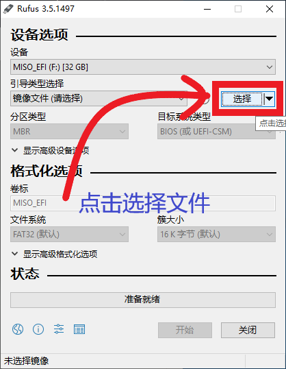

- 然后在弹出的文件选择窗里找到我们下载的系统文件并选中

    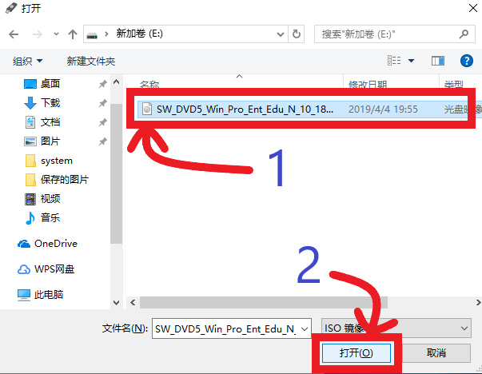

- 然后在下图中框的位置将分区类型选择为 **“MBR”** ，箭头处会显示为 **“BIOS-CSM**
    >**注意：**如果我们的电脑支持UEFI启动，那么分区推荐选择GPT，目标系统类型会是UEFI，UEFI相对于BIOS有一定的优势，不过这里为了兼容部分电脑做出了让步。如果想了解更多请直接搜索 **“UEFI+BIOS+MBR+GPT”**
  
    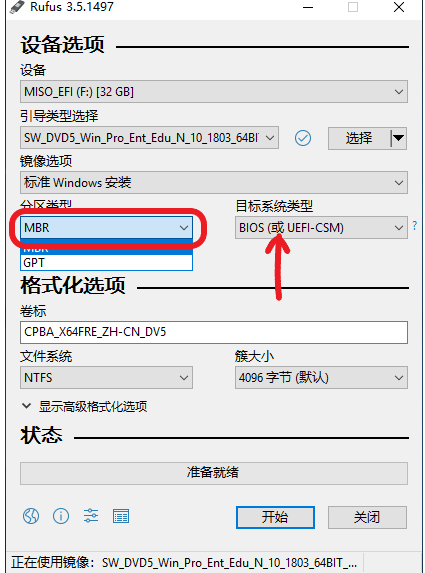

- 其余的部分我们一般不用更改，我们点击下面的开始按钮

    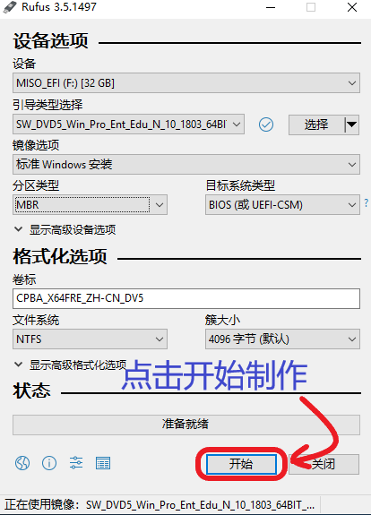

- 出现弹窗我们选择 **“确定”**

    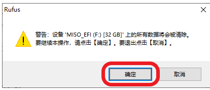

- 这时启动盘就开始制作了，下面的绿色进度条开始滚动

    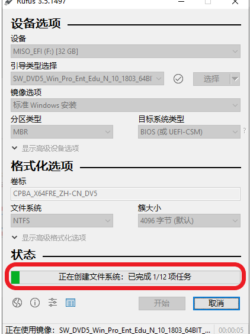

- 耐心等待几分钟，当绿色进度条充满时，我们的启动盘便做好了。

   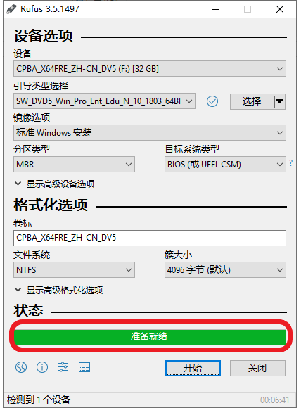

---
## 系统的安装
---

>什么是BIOS?
BIOS即Basic Input Output System(基本输入输出系统),其实，它是写在计算机主板上一个小芯片上的程序. 
我们在这里不用关注它的具体功能, 我们只要知道它控制着电脑的启动过程, 我们要在BIOS设置让电脑从u盘启动,从而开始安装系统.
跟随下面的教程我们可以轻松完成系统的安装.

### 从U盘启动

从U盘启动有两种方式，一种是临时让电脑从u盘启动，这种方式方便快捷，但不是所有主板都支持，另一种是从更改BIOS设置，繁琐但是所有主板都可以操作。我们首先来看看是不是支持临时从U盘启动

- 我们先将电脑彻底关机（长按电源键彻底关机）再按电源键开机

- 当出现品牌图标时：
  - 如果 有press xx to enter setup 字样表示我们按 xx按键进入BIOS设置界面

  - 如果 有press xx to change boot device 字样表示我们可以直接按 xx按键来

    更改启动位置

  - 如果 什么字样也没有，你可以：

    - 尝试按 **ESC** ，**Del**或**F1**到**F12** 来尝试进入BIOS或者更改启动硬盘界面

    - 我们可以通过搜索“电脑品牌 + BIOS”来确认如何进入BISO或者我们可以在出现品牌logo时
  
比如下图这台Acer电脑，我们可以按F12直接更改启动硬盘，也可以按F2进BIOS设置

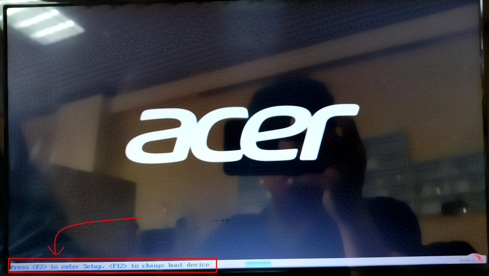

**注意： 如果我们的电脑可以进入更改启动硬盘界面，那我们优先选择更改启动硬盘的方式**
下面我们来以这台Acer为例子来介绍这两种方式

- 方式一   直接从u盘启动
  - 出现品牌logo时，根据上图的文字提示 我们按**F12** 进入选择启动硬盘界面
  - 我们上下按上下键可以选择从某个引导项启动，在这里我们可以看到这台电脑包含3个启动方式
    - SATA硬盘，也就是我们的window系统盘
    - Network，从网络启动
    - USB HDD，USB硬盘，也就是我们的启动盘，他包含两个启动项
      - Legacy，以传统方式引导
      - UEFI，以UEFI模式引导
  
    这里我们优先选择启动盘下的UEFI模式，即下图所标出的那一项，回车确认启动
    **注意：这里在USB HDD下你可能只看到Legacy或UEFI启动项，这是正常的，我们就选择出现的启动项启动.这是由于你的电脑不支持其中某种模式或者主板没有设置兼容模式**

  - 见到下面就成功引导了。
  

- 方式二   进BIOS修改启动顺序
  
    虽然BIOS有好几种，但不同的BIOS设置都大同小异，如果实在不清楚的，我们可以搜索 **“电脑型号+BIOS”** 或者 **“主板型号+BIOS”** 寻找教程
    
    下面以这台Acer为例来介绍

  - 开机时按照出现品牌logo的指示按**F2**，进入**BIOS**

  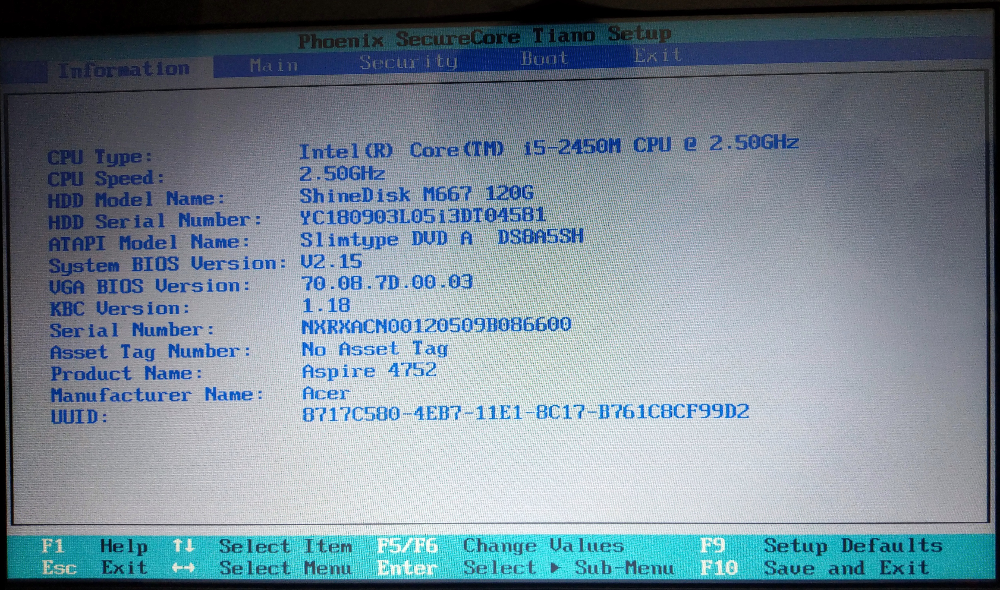

  - 然后我们通过左右键移动到Boot（启动）选项卡

  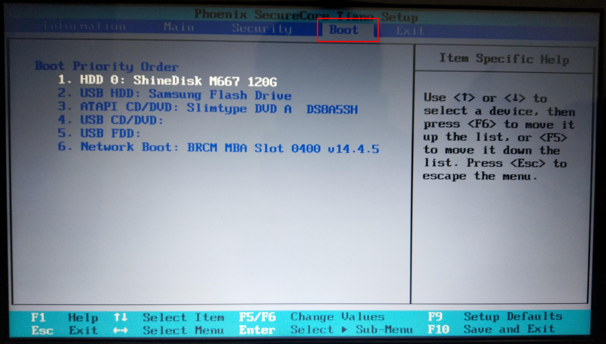

  - 在这里我们可以看到一个列表，电脑启动时将从列表第一项尝试启动，如果不能启动则尝试第二项，直到启动成功。我们需要做的是将我们的启动盘放到第一位。我们根据提示，使用上下键选中我们的启动盘，然后使用F5或者F6将选中的项目上下移动，**将我们的启动盘移到第一位**！

  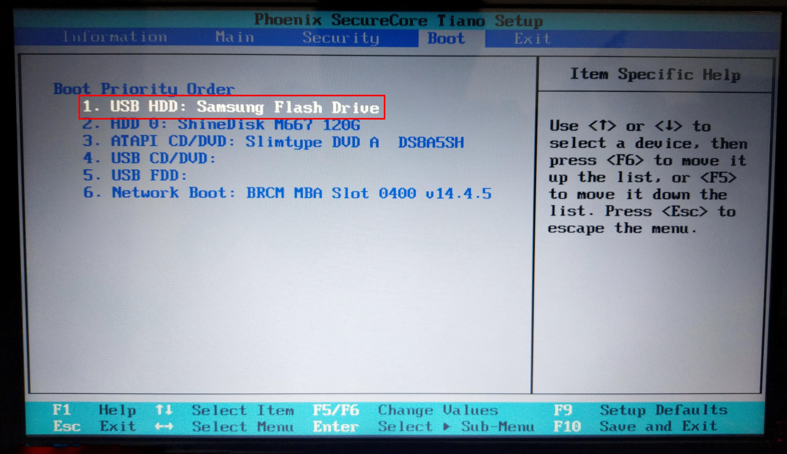

  - 根据屏幕下方的提示，我们按**F10**然后左右选中**YES**然后回车进行保存并开始启动。

   

  - 见到下面就成功引导了。

### 安装系统

OK 恭喜，你已经完成了最难的部分，下面就简单多了，我们很快就能体验新系统了。

- 在下面的画面中，我们选择Install Deepin。

- 稍等片刻你会看到语言选择页面，这时我们选择 **简体中文**。然后在 **我已阅读并同意**前打勾，然后点击下一步

- 接下来是创建用户页面，我们根据自己的需要填写即可，然后点击下一步

- 接下来是时区选择，这里默认是上海，我们无需更改，直接下一步

- 接下来是选择安装位置与分区，由于deepin的全盘安装分区比较合理，为了我们可以舒服的安装与使用我们这里仅介绍全盘安装，点击下图中的全盘安装。
  
- 这里我们就到了安装硬盘选择界面，如图，这台电脑只有一个238G的硬盘，直接选中，然后点击下一步即可。如果你有多个硬盘请看下面选择原则。
  
  - 如果电脑只有一个硬盘,我们直接选中安装即可。
  
  - 如果是多硬盘
        我们一般直接选择一个硬盘来装装系统，其余硬盘来作为数据盘即可。对于最常见的**1个固态硬盘加一个机械盘**，我们直接将系统安装在固态硬盘。固态硬盘安装的好处是系统启动快，软件可以达到秒开的效果，机械盘一般较大，我们可以储存我们的个人数据。

- 出现下图就是系统在安装了

- 出现下图时表示系统写入已经完成，**此时我们要拔下U盘**，点击 **立即体验**，系统会重启进入刚刚安装的系统。

---

## Deepin的基本使用

---

- 现在我们的电脑已经愉快的开机了，输入你刚刚配置的密码即可登录。
- 任务栏与启动器
    下面是任务栏，任务栏中依次是 启动器，文件管理器，应用商店，音乐，视频，Chrome浏览器，设置，快速控制板，电源，时间，和回收站。
    我们可以右键点击取消任务栏中的应用驻留。
    可以点击点击第一个图标打开启动器，右键点击任一图标发送到任务栏，或发送到桌面，设置开机自启动或者卸载。
- 文件管理器
  打开iaki文件管理器我们可以看到我们的一些常用目录，以及我们的分区磁盘和磁盘的分区
- 关于设置
  点击任务栏中的设置图标会弹出设置的面板，在这里我们可以对系统的网络，显示，声音，个性化等进行配置。
- 应用软件与应用商店
  DeepinLinux内置了一些我们常用的软件，比如，谷歌浏览器，WPS办公软件，QQ，网易云音乐，雷鸟邮件等，这些软件与Windows下的软件使用基本一致。
  对于没有预装的软件，比如TIM，微信，百度网盘等，我们可以打开应用商店进行搜索下载安装。

## 恭喜

&nbsp;

&nbsp;

&nbsp;

&nbsp;

&nbsp;

&nbsp;

&nbsp;

&nbsp;

# 你可以愉快的使用电脑了！O(∩_∩)O~~
